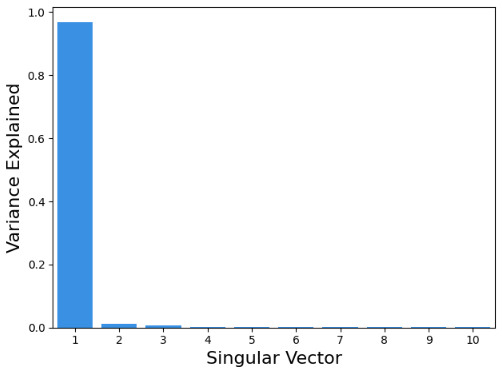
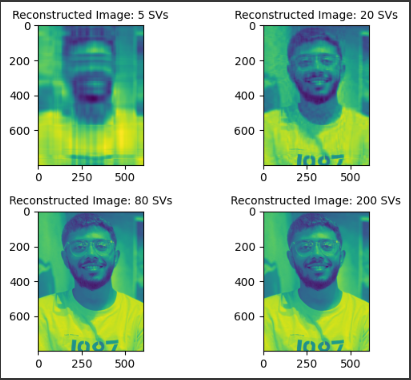

# SVD Image Compression

A Python implementation demonstrating image compression using Singular Value Decomposition (SVD). This project shows how to reduce image file size while preserving essential visual information by reconstructing images using only the most significant singular values.

## Overview

Singular Value Decomposition (SVD) is a matrix factorization technique that decomposes a matrix into three components: U, Σ (S), and V^T. In image compression, SVD helps identify the most important features of an image and allows reconstruction using fewer components, resulting in compression.

## Features

- Convert color images to grayscale for SVD processing
- Apply SVD to image matrices with proper scaling
- Visualize variance explained by singular vectors
- Reconstruct images using different numbers of singular values
- Compare compression quality across different compression levels
- Generate comparison plots showing reconstruction quality

## Requirements

```
numpy
pandas
opencv-python
scikit-image
Pillow
matplotlib
seaborn
```

## Installation

1. Clone or download the repository
2. Install required packages:
```bash
pip install numpy pandas opencv-python scikit-image pillow matplotlib seaborn
```

## Usage

1. Place your image file in the same directory as the script and name it `image.jpg`
2. Run the script:
```bash
python svd.py
```

The script will:
- Load and convert your image to grayscale
- Apply SVD to the image matrix
- Generate a variance plot showing the importance of each singular vector
- Create reconstructed images using 5, 20, 80, and 200 singular values
- Display a comparison grid of all reconstructed images

## How It Works

### 1. Image Preprocessing
- Loads the input image using scikit-image
- Converts from color to grayscale using OpenCV
- Scales pixel values from [0, 255] to [0, 1] for numerical stability

### 2. SVD Decomposition
```python
U, S, V = np.linalg.svd(image_matrix_scaled)
```
Where:
- **U**: Left singular vectors (image spatial patterns)
- **S**: Singular values (importance weights)
- **V**: Right singular vectors (image feature patterns)

### 3. Image Reconstruction
Images are reconstructed using the formula:
```python
reconstructed_image = U[:, :n] @ diag(S[:n]) @ V[:n, :]
```
Where `n` is the number of singular values to use.

### 4. Compression Analysis
The script analyzes how much variance each singular vector explains:
```python
var_explained = S**2 / np.sum(S**2)
```

## Output Files

- `svd_plot.png`: Bar chart showing variance explained by the first 10 singular vectors
- Displayed plots: Comparison grid of reconstructed images with different compression levels

## Compression Levels Demonstrated

| Singular Values | Compression Level | Quality |
|----------------|------------------|---------|
| 5              | Highest          | Basic outline |
| 20             | High             | Recognizable features |
| 80             | Medium           | Good detail |
| 200            | Low              | High detail |

## Key Insights

1. **First few singular values matter most**: The variance plot typically shows that the first 3-5 singular values capture the majority of image information.

2. **Diminishing returns**: Adding more singular values provides progressively smaller improvements in image quality.

3. **Compression trade-off**: Higher compression (fewer singular values) reduces file size but also image quality.

## Customization

### Change the number of singular values:
```python
n = 50  # Use top 50 singular values
reconstructed_image = np.array(U[:, :n]).dot(np.diag(S[:n])).dot(np.array(V[:n, :]))
```

### Use different image formats:
Simply change the `url` variable to point to your image file:
```python
url = 'your_image.png'
```

### Adjust scaling:
For images with different value ranges, modify the scaling factor:
```python
image_matrix_scaled = image_matrix / max_value
```

## Mathematical Background

SVD decomposes an m×n matrix A as:
```
A = UΣV^T
```

Where:
- U is an m×m orthogonal matrix
- Σ is an m×n diagonal matrix with singular values
- V^T is an n×n orthogonal matrix

For compression, we use only the k largest singular values:
```
A_k = U_k Σ_k V_k^T
```

## Performance Considerations

- **Memory usage**: Large images require significant memory for SVD computation
- **Processing time**: SVD computation time increases with image size
- **Storage**: Compressed representation requires storing U[:,:k], S[:k], and V[:k,:]

## Limitations

- Works best with grayscale images
- SVD computation can be slow for very large images
- Quality depends heavily on image content and chosen compression level
- Not suitable for real-time applications without optimization

## Demonstration

--


